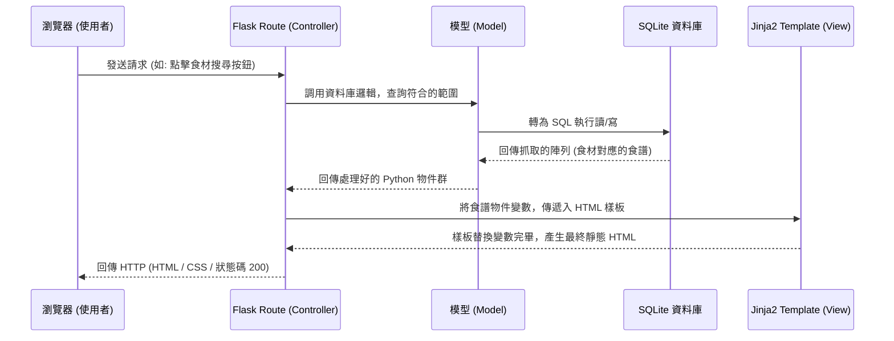

# 系統架構設計文件 (Architecture)

這份文件基於 PRD 的需求，規劃「食譜收藏夾系統」的技術架構、專案資料夾目錄與各系統元件間的互動關係。

---

## 1. 技術架構說明

為了能高效率開發出容易維護的網頁應用程式，本專案的技術堆疊選用如下：

### 選用技術與原因
- **後端端點與邏輯控制**：Python 搭配 **Flask**。它是一個極輕量且靈活的框架，很適合快速建立 MVP 並方便擴展套件。
- **資料庫選擇**：**SQLite**。不需要安裝與維護獨立的資料庫伺服器引擎，會直接將資料庫保存在專案目錄內，並具備足夠的關聯式資料庫特性以處理此系統的資料流。
- **畫面與模板引擎**：**Jinja2**（負責 HTML 頁面渲染）。這是一個強大的 Python 樣板引擎，能夠在傳送網頁到用戶端前，把資料庫查到的資訊無縫整合進 HTML 中。
- 因專案屬性，不採用大型前端框架做前後端分離，統一由 Flask + Jinja2 在伺服器端將網頁完成渲染 (Server-Side Rendering)，有助於 SEO 並且易於開發。

### Flask MVC 模式說明
雖然 Flask 是微框架，但為了團隊協作，我們會使用類似 MVC（Model-View-Controller）的模式梳理架構，各模組職責分別為：
- **Model (資料模型)**：負責定義資料長相 (例如 User 用戶與 Recipe 食譜)，建立類別 (Class)，並協助 Controller 透過 SQLAlchemy 操作底層的 SQLite 資料庫引擎。
- **View (視圖)**：負責將資料呈現給用戶看。在我們的架構裡對應到 `templates/` 資料夾裡的各個 Jinja2 HTML 樣板，與 `static/` 下的樣式表 (CSS) 等等。
- **Controller (控制器)**：負責管控流程的「大腦」。對應到 `routes/` 裡的各個路由，它接收瀏覽器傳來的參數、呼叫 Model 拿資料、並且把資料交給 View 來產生正式的 HTML 回傳給瀏覽器。

---

## 2. 專案資料夾結構

為保持專案結構的條理，會採用以下層次分明的資料夾組織：

```text
web_app_development/
├── app/
│   ├── __init__.py      # Flask 應用程式工廠與所有模組初始化設定
│   ├── models/          # (Model) 資料庫模型定義結構與關聯設定
│   │   ├── __init__.py 
│   │   ├── user.py      # 用戶帳號模型
│   │   └── recipe.py    # 食譜、食材與收藏夾模型
│   ├── routes/          # (Controller) Flask 藍圖路由 (Blueprints)
│   │   ├── __init__.py
│   │   ├── auth.py      # 會員註冊、登入登出路由
│   │   ├── main.py      # 網站首頁、食譜瀏覽、食材搜尋等一般路由
│   │   └── admin.py     # 後台管理員專用路由
│   ├── templates/       # (View) Jinja2 HTML 模板
│   │   ├── base.html    # 全站公用語法 (如選單、頁尾、head)
│   │   ├── index.html   # 首頁樣板
│   │   ├── auth/        # 會員登入相關頁面樣板
│   │   └── recipe/      # 食譜細部呈現與搜尋結果樣板
│   └── static/          # 靜態資源存放處
│       ├── css/         # 原生 CSS 檔
│       ├── js/          # 前端原生互動邏輯 JavaScript
│       └── images/      # 用戶食譜照片或是網站靜態 icon
├── instance/            # 由 Flask 預設負責放置特定設定或本機開發檔案
│   └── database.db      # SQLite 資料庫 (請加入 .gitignore 避免被版控)
├── docs/                # 共用文件區
│   ├── PRD.md           # 產品需求文件
│   └── ARCHITECTURE.md  # 系統架構說明書 (本文件)
├── requirements.txt     # 開發環境依賴套件表 (記錄 Flask 等版本)
├── .gitignore           # 設定哪些檔案不用丟到 Git
└── app.py               # 專案主程式進入點，負責執行後台啟動伺服器
```

---

## 3. 元件關係圖

以下展示各元件 (瀏覽器、Controller 路由、Model 資料庫設計及 View 樣板) 如何交互運作去呈現一個畫面。



---

## 4. 關鍵設計決策

1. **採 Flask Blueprints 切割路由**
   - **原因**：PRD 其中有一項特別標出「後台內容與用戶管理」，可預見整個專題不會只有 10 支 API。若將全部路徑擠在同個檔案內，維護代工與 Git 衝突機率大幅提升。採用 Blueprint 依照模組切割（前台、後台、身分驗證），未來擴充新功能極度容易。
2. **採用 SQLAlchemy 作為 ORM 框架**
   - **原因**：能用 Python Object oriented 的語法直接操作資料庫（而非手刻 SQL 語法拼貼），大幅增加存取速度與避免 SQL Injection 安全問題，更方便處理「食材對應食譜（多對多）」的關聯操作。
3. **無前後端分離且極少化 JavaScript**
   - **原因**：為了將開發焦點聚焦於後端功能邏輯及資料庫運用，我們的畫面傳遞盡可能以「後端產生 Jinja2 + 全頁更新」的傳統表單提交去實作。若非必要（如輸入框連動或非同步小彈窗），盡量避免引進複雜的前端 AJAX 操作。
4. **將資料庫檔案放在 instance/ 並加入 .gitignore**
   - **原因**：通常開發時使用的 SQLite 將含有測試資料或者管理員預設機密帳號，避免提交到版控不僅是規範考量，也杜絕不同開發者間合併覆蓋 (Merge Conflict) 資料庫實體檔的風險。
