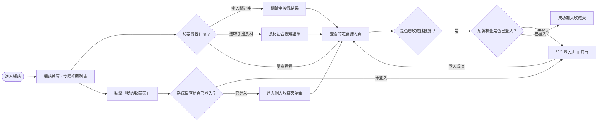
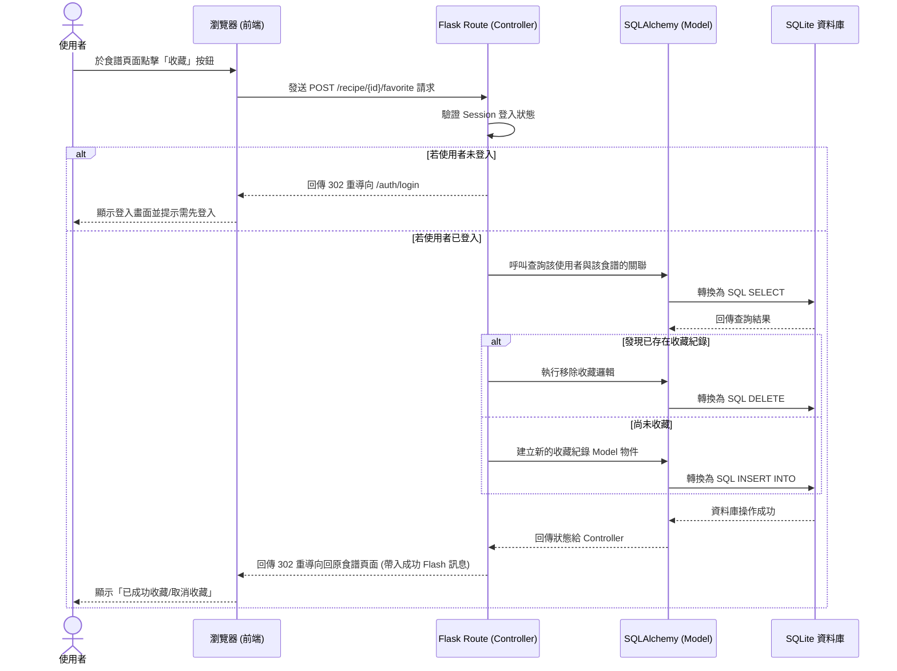

# 流程圖文件 (Flowchart)

本文件根據需求 (PRD) 與系統架構 (Architecture)，規劃出「食譜收藏夾系統」的使用者操作邏輯動線，與核心功能的系統序列資料流方向。

---

## 1. 使用者流程圖 (User Flow)

描述「一般使用者」從進入網站到尋找食譜、並加入收藏的操作路徑與決策點。
*(此圖表使用 Mermaid 語法撰寫)*

---

## 2. 系統序列圖 (Sequence Diagram)

此序列圖描述核心互動：「使用者點擊加入收藏」到「資料存入 SQLite」的完整系統內部交握流程。
*(此圖表使用 Mermaid 語法撰寫)*

---

## 3. 功能清單對照表

根據 PRD 定義的 5 項功能，規劃對應的 URL 路徑機制與 HTTP 方法。

| 功能區塊 | 操作動作 | 對應 URL 路徑 | HTTP 方法 | 備註說明 |
| :--- | :--- | :--- | :--- | :--- |
| **瀏覽與搜尋食譜** | 瀏覽首頁與推薦清單 | `/` | GET | 呈現全站食譜概覽 |
| | 關鍵字搜尋 | `/search` | GET | 帶有 `?q=關鍵字` 的查詢 |
| | 食材組合搜尋 | `/search/ingredients` | GET | 根據食材參數反查關聯食譜 |
| | 檢視食譜詳細資料 | `/recipe/<int:recipe_id>` | GET | 含圖片、材料表與步驟 |
| **儲存食譜** | 加入 / 取消收藏 | `/recipe/<int:recipe_id>/favorite` | POST | 點擊按鈕觸發的狀態切換，需登入 |
| | 查看我的收藏夾 | `/my/favorites` | GET | 呈現該會員的所有收藏，需登入 |
| **會員管理** | 註冊新帳號視圖 | `/auth/register` | GET | 顯示註冊表單 |
| | 提交註冊資料 | `/auth/register` | POST | 建立 User，密碼加密 |
| | 登入視圖 | `/auth/login` | GET | 顯示登入表單 |
| | 提交登入資料 | `/auth/login` | POST | 驗證密碼，派發 Session |
| | 登出 | `/auth/logout` | POST / GET | 清除 Session 跳回首頁 |
| **管理員功能** | 進入後台食譜列表 | `/admin/recipes` | GET | 需驗證管理員身分 |
| | 刪除不當食譜 | `/admin/recipe/<int:recipe_id>/delete` | POST | 將該食譜從資料庫連帶關聯中移除 |
